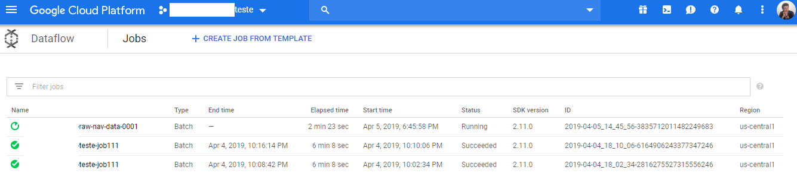
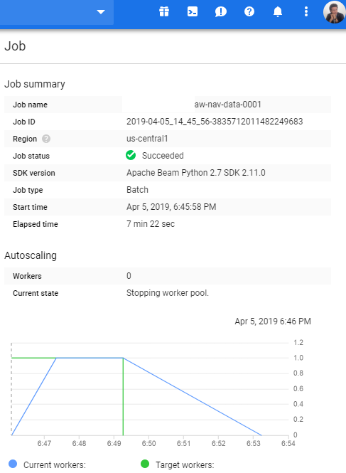
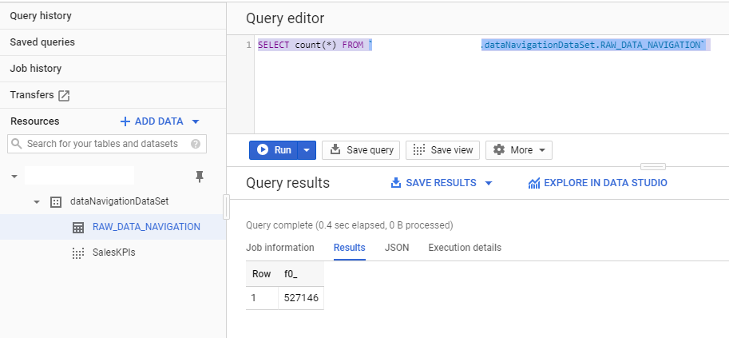
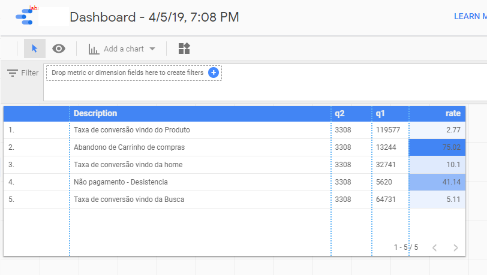
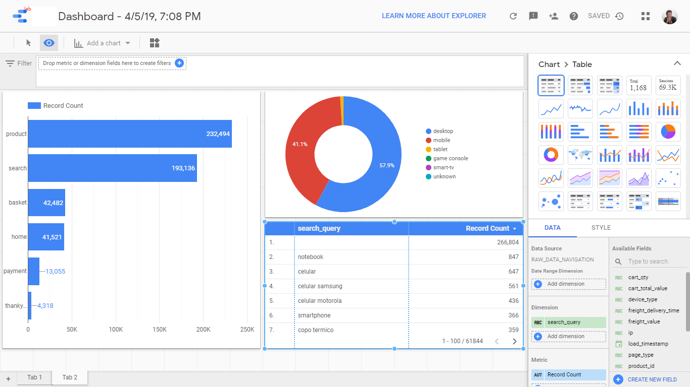
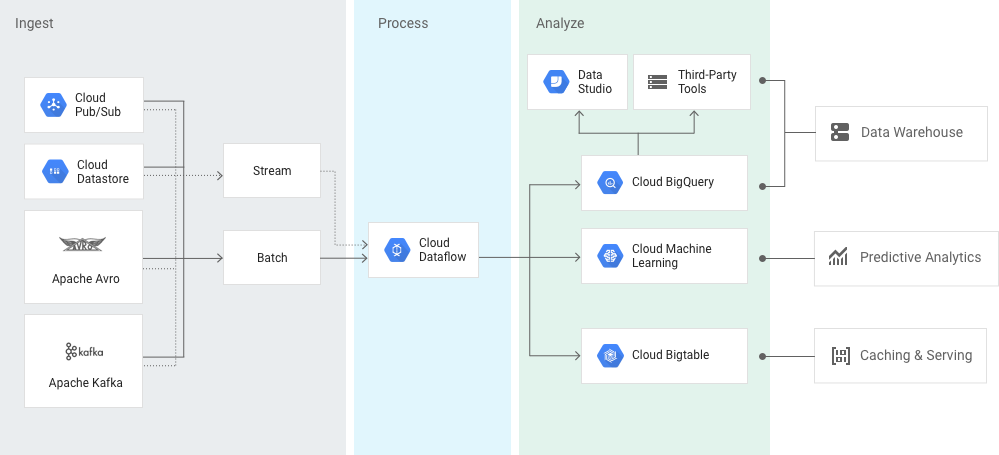

# Solução auto escalável de importação de CSV e geração indicadores utilizando todo ecosistema do Google Cloud
### Repositório criado com objetivo de detalhar solução, desde as motivações da arquitetura até a implementação. 
#### Motivação: Cliente possui site que a cada 1 minuto gera um arquivo de log no formato CSV de 400 MB. 
Esse arquivo possui log eventos de todo ciclo de navegação de cada cliente desde o acesso inicial ao site até o pagamento. 
#### Desafio: Desenhar solução escalável que leia esses arquivos para extrair informações relevantes para o cliente, como: 
KPIs importantes como taxa de conversão, taxa de abandono de carrinho de compras entre outros. 


### O escopo desse documento se divide nos seguintes tópicos.

#### 1. Arquitetura Proposta
#### 2. Motivação da Proposta
#### 3. Execução da pipeline
#### 4. Implementação
#### 5. Proposta de evolução
#### 6. Referências
#### 7. Quem sou eu?

### 1. Arquitetura Proposta


#### 1.2 Fluxo Principal

A arquitetura tem o seguinte fluxo principal:

1. A função [index.js](index.js) no [Google Cloud Functions](https://cloud.google.com/functions/features/?hl=pt-br) fica monitorando o bucket seu-projeto-nome-no-google a procura por novos arquivos adicionados no [Google Storage](https://cloud.google.com/storage/?hl=pt-Br)
2. Essa função tem uma trigger que é informada quando um novo arquivo é adicionado no bucket, logo, acionando o orquestrador [simple_load_dag.py](simple_load_dag.py) no [Google Composer](https://cloud.google.com/composer/?hl=pt-br).  
3. [Google Composer](https://cloud.google.com/composer/?hl=pt-br) executa o script python [storage-to-dataflow-to-bigquery.py](storage-to-dataflow-to-bigquery.py) no [Google DataFlow](https://cloud.google.com/dataflow/?hl=pt-br), que é a nossa pipeline,  que pega os arquivos CSVs adicionados no bucket transforma no formato conhecido e adiciona na tabela do [BigQuery](https://cloud.google.com/bigquery/?hl=pt-br).
4. Inserindo cada linha e campo do CSV na tabela seu-projeto-nome-no-google:dataNavigationDataSet.RAW_DATA_NAVIGATION do [BigQuery](https://cloud.google.com/bigquery/?hl=pt-br), dando tudo certo, o [Google Composer](https://cloud.google.com/composer/?hl=pt-br), move o CSV para o bucket seu-projeto-nome-no-google-bucket-navi-out.   
5. A view [SalesKPI.sql](SalesKPI.sql) criada [BigQuery](https://cloud.google.com/bigquery/?hl=pt-br) possui indicadores relevantes para o projeto.
6. Essa view é acessada pelo Google [DataStudio](https://datastudio.google.com/) gerando [relatório](datastudio2.png) e os [indicadores](datastudio.png).

#### 1.3 Breve descrição de cada step na sua ordem de chamada, com seu devido google marketing.
+ [Google Storage](https://cloud.google.com/storage/?hl=pt-Br), nosso storage aonde colocaremos nossos arquivos CSV para serem processados.
> Armazenamento unificado de objetos para desenvolvedores e empresas
+ [Google Cloud Functions](https://cloud.google.com/functions/features/?hl=pt-br), nossa trigger que avisa quando um novo arquivo for adicinado no bucket. 
> A maneira mais fácil de executar e escalonar o código na nuvem
+ [Google Composer](https://cloud.google.com/composer/?hl=pt-br), nosso orquestrador que fará a gestão de todo workflow.
> Um serviço de orquestração do fluxo de trabalho totalmente gerenciado criado no Apache Airflow
+ [Google DataFlow](https://cloud.google.com/dataflow/?hl=pt-br), responsável pela gestão da pipeline dos dados.
> Processamento simplificado de dados de stream e em lote, com a mesma confiabilidade e expressividade
+ [BigQuery](https://cloud.google.com/bigquery/?hl=pt-br), nosso banco de dados.
> Um armazenamento de dados na nuvem rápido, altamente dimensionável, econômico e totalmente gerenciado para análise com machine learning.
+ [DataStudio](https://datastudio.google.com/), nossa ferramenta para criação de relatórios. 
> Desbloqueie o poder de seus dados com painéis interativos e relatórios bonitos que inspiram decisões de negócios mais inteligentes.

### 2 Motivação da Proposta
Para essa essa arquitetura priorizamos não obrigar instalar nenhuma biblioteca ou ferramenta localmente, tudo será instalado na núvem.  
Cobre requisitos do cliente e outros como escalabilidade sob demanda, modelo de programação simplificado e opensource, controle de custo, gerenciamento automático de recursos, que conforme a google diz:
> "Recursos praticamente ilimitados".

#### 2.1 Motivação Pessoal para Arquitetura

##### 2.1.1 Porque desenhar toda solução na núvem e não localmente ?
Como meu computador não é muito bom, experimentar qualquer solução localmente seria lastimável. 
##### 2.1.2 Porque utilizando o Google Cloud ?
Escolhi o google por já ter bastante contato toda solução Cloud do [Firebase](https://firebase.google.com), inclusive o Functions para um projeto pessoal com IONIC. Também porque eu ganhei um voucher por 6 meses para utilizar todos o serviços do Google Cloud gratuitamente.
##### 2.1.3 Porque utilizar Python e não Java ?
Porque Java eu já tenho bastante experiência e Python para esse tipo de projeto eu teria um código mais limpo.
##### 2.1.4 Porque utilizar Google DataStudio ?
Utilizei aqui para simplificar o nosso exemplo, o customização dos relatórios é muito limitada, indicaria soluções como Tableau, SAP BO, SAS entre outros, dependeria do orçamento.

### 3. Execução da pipeline

Siga os passos abaixo aonde iremos simular toda execução da pipeline inserindo um arquivo no bucket seu-projeto-nome-no-google, visualizando desde a adição do CSV no bucket até a atualização da view no BigQuery com os indicadores.

Acesse os links abaixo utilizando o usuário e senha fornecido por email.

3.1 Acesse o [cloud terminal shell](https://console.cloud.google.com/cloudshell/editor?shellonly=true&fromcloudshell=true).

3.2. Execute o seguinte comando para copiar um CSV da pasta do bucket temp para a pasta que esta sendo monitorada pelo Cloud Functions:
```console
gsutil cp -p gs://seu-projeto-nome-no-google-bucket-navi-temp/dados_navegacionais_p1.csv gs://"seu-projeto-nome-no-google/dados_navegacionais_p1.csv"

```
3.3. Veja o acionamento do trigger no [Cloud Functions](https://console.cloud.google.com/functions/details/us-central1/call-composer-on-file?folder&organizationId&tab=general&duration=PT1H).

3.4. Veja que o [Google Composer esta up](https://console.cloud.google.com/composer/environments?_ga=2.231835800.-640181581.1548091189) , caso queira veja o log.

3.5. Veja que a pipeline foi iniciada no [Google Dataflow](https://console.cloud.google.com/dataflow?folder&organizationId), aguarde o job finalizar.

3.6. Veja a tabela [seu-projeto-nome-no-google.dataNavigationDataSet.RAW_DATA_NAVIGATION](https://console.cloud.google.com/bigquery?sq=369773693133:4c76b9581da4490bb87c72b0c7e6222d) atualizada, assim como os [KPIs](https://console.cloud.google.com/bigquery?sq=369773693133:031bde7c38fe4164af00c6c6921d5721).

3.7. Veja os arquivos processados foram apagadas do bucket [seu-projeto-nome-no-google](https://console.cloud.google.com/storage/browser) movidos para o bucket [seu-projeto-nome-no-google-bucket-navi-out](https://console.cloud.google.com/storage/browser)

### 4. Implementação

#### 4.1 Dataflow

##### Telas do Dataflow na execução do job




##### Exemplo com csv que deve ser importado no bucket do seu google storage:

> [dados_navigacionais_100.csv](dados_navigacionais_100.csv)

##### Exemplo arquivo python com a implementação do JOB para rodar no Google Dataflow:

> [storage-to-dataflow-to-bigquery.py](storage-to-dataflow-to-bigquery.py)

Com os seguintes pontos importantes, para customização do script:

Linha 121: A separação dos campos no CSV e os tipos de cada um, para criação da tabela do banco.
```python
schema='load_timestamp:STRING,ip:STRING,visit_id:STRING,device_type:STRING,url_location:STRING,page_type:STRING,search_query:STRING,product_id:STRING,site_department_id:STRING,product_unit_price:STRING,freight_delivery_time:STRING,freight_value:STRING,cart_qty:STRING,cart_total_value:STRING',
```
Os tipos são os mesmos do SCHEMA das tabelas do BigQuery.

Linha 38: Pega as linhas do CSV e transforma no formato entendível pelo BigQuery, informando a ordem dos campos no CSV.
```python
    row = dict( zip(('load_timestamp', 'ip', 'visit_id', 'device_type', 'url_location', 'page_type', 'search_query', 'product_id', 'site_department_id', 'product_unit_price', 'freight_delivery_time', 'freight_value', 'cart_qty', 'cart_total_value'),
                values))
```

Linha 104:  CREATE_IF_NEEDED cria a tabela caso não exista.
Linha 106:  WRITE_TRUNCATE apaga a tabela caso exista e insira, esta assim a título de exemplo, mas deveria ser: WRITE_APPEND
```python
            create_disposition=beam.io.BigQueryDisposition.CREATE_IF_NEEDED,
            # Deletes all data in the BigQuery table before writing.
            write_disposition=beam.io.BigQueryDisposition.WRITE_TRUNCATE)))
```
Aqui você pode ver mais detalhes desse parâmetros:
https://beam.apache.org/documentation/io/built-in/google-bigquery/

##### Exemplo de execução de pipeline terminal shell do google cloud:

```python
python storage-to-dataflow-to-bigquery.py --input gs://seu-projeto-nome-no-google-bucket-navigation/dados_navegacionais* --output seu-projeto-nome-no-google:dataNavigationDataSet.RAW_DATA_NAVIGATION --runner DataflowRunner --project seu-projeto-nome-no-google --job_name job-name-001 --temp_location gs://seu-projeto-nome-no-google-bucket-navigation/tmp/
```

#### 4.2 BigQuery



Foi criada seguinte view seu-projeto-nome-no-google:dataNavigationDataSet.SalesKPI, com os indicadores mais relevantes:
```sql
    SELECT  'Abandono de Carrinho de compras' as Description, basket.losing as q1, thankyou.buy as q2, 100-ROUND((thankyou.buy / basket.losing)*100, 2) as rate  FROM
(SELECT count(distinct visit_id) as losing FROM `seu-projeto-nome-no-google.dataNavigationDataSet.RAW_DATA_NAVIGATION` 
where page_type = 'basket') basket
CROSS JOIN
(SELECT count(distinct visit_id) as buy FROM `seu-projeto-nome-no-google.dataNavigationDataSet.RAW_DATA_NAVIGATION` 
where page_type = 'thankyou') thankyou
union all
SELECT  'Taxa de conversão vindo da home', home.visit, thankyou.buy, ROUND((thankyou.buy / home.visit)*100, 2) as conversion_rate_home  FROM
(SELECT count(distinct visit_id) as visit FROM `seu-projeto-nome-no-google.dataNavigationDataSet.RAW_DATA_NAVIGATION` 
where page_type = 'home') home
CROSS JOIN
(SELECT count(distinct visit_id) as buy FROM `seu-projeto-nome-no-google.dataNavigationDataSet.RAW_DATA_NAVIGATION` 
where page_type = 'thankyou') thankyou
union all
SELECT  'Taxa de conversão vindo da Busca', home.visit, thankyou.buy, ROUND((thankyou.buy / home.visit)*100, 2) as conversion_rate_home  FROM
(SELECT count(distinct visit_id) as visit FROM `seu-projeto-nome-no-google.dataNavigationDataSet.RAW_DATA_NAVIGATION` 
where page_type = 'search') home
CROSS JOIN
(SELECT count(distinct visit_id) as buy FROM `seu-projeto-nome-no-google.dataNavigationDataSet.RAW_DATA_NAVIGATION` 
where page_type = 'thankyou') thankyou
union all
SELECT  'Taxa de conversão vindo do Produto', home.visit, thankyou.buy, ROUND((thankyou.buy / home.visit)*100, 2) as conversion_rate_home  FROM
(SELECT count(distinct visit_id) as visit FROM `seu-projeto-nome-no-google.dataNavigationDataSet.RAW_DATA_NAVIGATION` 
where page_type = 'product') home
CROSS JOIN
(SELECT count(distinct visit_id) as buy FROM `seu-projeto-nome-no-google.dataNavigationDataSet.RAW_DATA_NAVIGATION` 
where page_type = 'thankyou') thankyou
union all
SELECT  'Não pagamento - Desistencia', home.visit, thankyou.buy, 100-ROUND((thankyou.buy / home.visit)*100, 2) as conversion_rate_home  FROM
(SELECT count(distinct visit_id) as visit FROM `seu-projeto-nome-no-google.dataNavigationDataSet.RAW_DATA_NAVIGATION` 
where page_type = 'payment') home
CROSS JOIN
(SELECT count(distinct visit_id) as buy FROM `seu-projeto-nome-no-google.dataNavigationDataSet.RAW_DATA_NAVIGATION` 
where page_type = 'thankyou') thankyou


```

#### 4.3 DataStudio
##### Exemplo de de possiveis dashboards e relatórios que podem ser criados:

##### Dashboard principal


### 5 Proposta de Evolução DataStudio
##### O mundo perfeito é evoluir para o seguinte workflow, caso queira contribuir de alguma forma, commits são bem vindos.


### 6 Referências

#### gcp-batch-ingestion-pipeline-python
https://github.com/servian/gcp-batch-ingestion-pipeline-python

#### Triggering DAGs (workflows)
https://cloud.google.com/composer/docs/how-to/using/triggering-with-gcf

#### Cloud Composer Examples
https://github.com/GoogleCloudPlatform/professional-services/tree/master/examples/cloud-composer-examples

#### Triggering a Cloud Composer DAG from Cloud Functions
https://github.com/GoogleCloudPlatform/nodejs-docs-samples/tree/058f03387f7acbec25b2ac363c3fe584572e1777/functions/composer-storage-trigger

#### Orchestrating jobs with Apache Airflow/Cloud Composer
https://hcoelho.com/blog/63/Orchestrating_jobs_with_Apache_Airflow_Cloud_Composer

### 7. Quem sou eu...
#### Sou Samuel Balbino, apaixonado por desenvolvimento de softwares e manipulação de dados. 
#### Caso queira ser meu amigo virtual, tenha dúvidas, questionamentos ou precise alguma consultoria, é só me procurar nas rede sociais abaixo:

https://linktr.ee/samueljboficial
